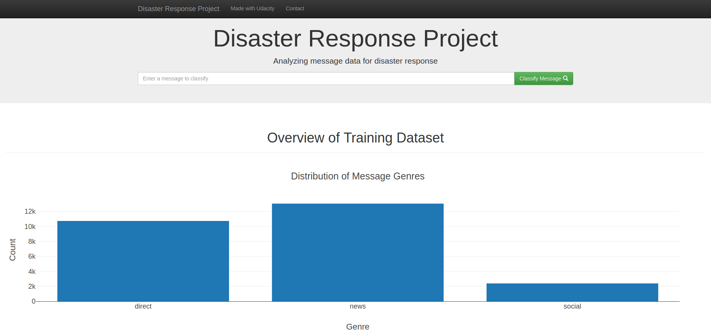

### Table of Contents

1. [Requirements](#requirements)
2. [Project Overview](#overview)
3. [File Descriptions](#files)
4. [Running](#running)
5. [Results](#results)
6. [Licensing and dataset](#licensing-data)

## Requirements 

- Python 3
- The comple list of requirents can be found at `requirements.txt`

## Project overview

This project uses NLP to classify disaster related messages. The dataset is provided by [Figure Eight](https://www.figure-eight.com/).

### Figure 1 

    

### Figure 2 

    

### Figure 3 

    

## File Descriptions 

<pre>
.
├── app
│   ├── run.py----------------------------# Flask app
│   └── templates
│       ├── go.html-----------------------# Template to display the result labels
│       └── master.html-------------------# Main page template with the search and menu
├── data
│   ├── DisasterResponse.db---------------# The database containing the cleaned dataset
│   ├── disaster_categories.csv-----------# Raw data with the message-id and categories
│   ├── disaster_messages.csv-------------# Raw data with the message text and genre
│   └── process_data.py-------------------# ETL script
│   └── language_utils.py-----------------# Script with a set of text-related functions
│   └── test_etl_pipeline.py--------------# Test script for the ETL pipeline
│   └── test_language_utils.py------------# Test script for the language utils script
├── models
│   └── train_classifier.py---------------# Train the model 
│   └── nlp_extractors.py-----------------# Script with a set of functions related to NLP (Tokenizers, extractors) 
│   └── classifier.pkl--------------------# The trained model
│   └── linear_model_metrics.csv----------# The file with training score for each category (precision, recall, f1-score)
├── images
│   └── Images for the documentation
</pre>

## Running

A live version of the app is available [here](http://disaster-response.brunobitencourt.com/).

If you want to run locally, just execute the following command:

<pre>
python app/run.py
</pre>

To execute the pipeline:
<pre>
python process_data.py messages.csv categories.csv DisasterResponse.db
</pre>

To train the model:
<pre>
python train_classifier.py ../data/DisasterResponse.db classifier.pkl
</pre>

`WARNING`: The default training parameters could take too long to run. In my machine, it takes about 12.2 hours to train.
Consider changing the `train_classifier.py` to remove some parameters from the Grid Search.

## Results and discussion

- The dataset is imbalanced. Some categories have about 100 samples, others over 10K;
- By the visualizations, the recall is high related to the number of samples available;
- The category `child_alone` was removed from training since it has no samples from it; 
    - Motivation: 
        - Could confuse the user of the model, since always will return false for this category. 
        - Some models and classification reports require at least a true/false sample for each category.
- While working with the data, I realized that several messages had partially translated or are in several other languages such as Portuguese, Spanish, and others. So, I try to translate the messages using the Yandex Translator API.
    - In the end, the overall performance was about the same as the original model;
    - The model available at this repository was trained over the original dataset `messages.csv`;
    - Anyways, the translated messages are available at `messages_with_translation.csv`;

#### The NLP

- I've used the Spacy with nltk since spacy has more stop words for English;
- I also manually added some stop words for Portuguese/Spanish, since I've seen several messages in these languages;
- **QuestionExtractor**: Extracts the feature if the message contains a question. I've also used Space here.
- **NumericDigitExtractor**: Extracts the feature if the message contains any digit.

#### Translation

- Here, an example of the message translation to English US, the first column are the message column from the dataset, the middle column, is the original column, already on the dataset. The last column, is the message translated on the Yandex Service.

### Figure 4 

    

- The translation was good in terms like SVP, an abbreviation to please and English, and other similar terms.
- But, in general, several stop words are added, acting like a corrector for the messages. In the end, these words are removed anyway, so this could be the reason it has not helped so much.

#### Further improvements

- At this time, I prefer not use a oversampling techinique, since the only effect at this case will be train the model with test samples;
- A possible technique will be extract more samples from sites like twitter, related to this categories;

## Licensing and dataset

- The quickstart code for the webapp was provided by Udacity
- The dataset is provided by [Figure Eight](https://www.figure-eight.com/).
